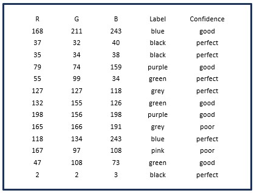
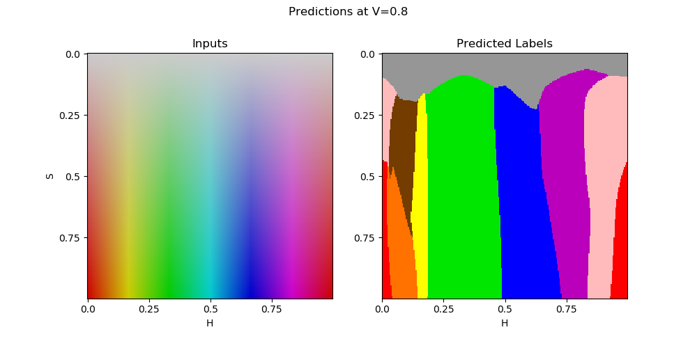
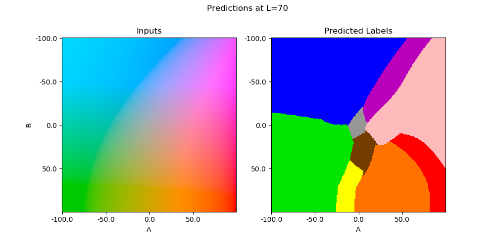
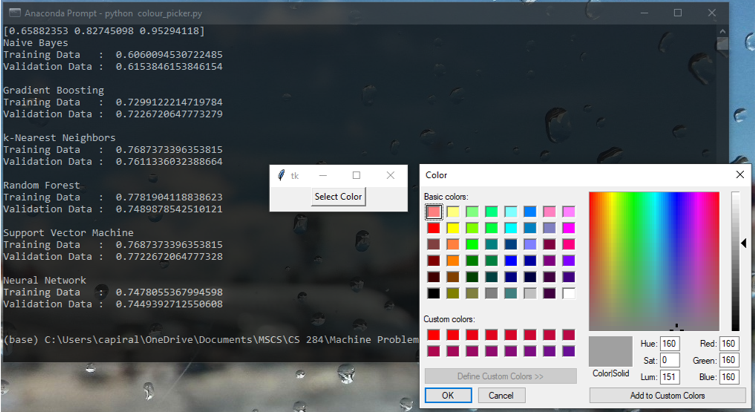
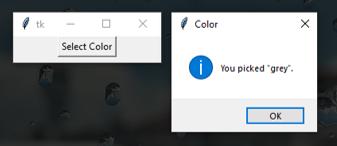

# COLOUR WORDS

+ The visual world, the world as we see it, is a world populated by colored objects. 

+ Typically, we see the world as having a rich tapestry of colors or colored forms—fields, mountains, oceans, skies, hairstyles, clothing, fruit, plants, animals, buildings, and so on. Colors are important in both identifying objects, i.e., in locating them in space, and in re-identifying them.

+ Humans use words to describe colors whereas computers see the world as pixels stored in binary – 0’s and 1’s.

+ How do we convert this digital information into words which the humans can easily understand?

+ Colour Words is a python program that uses machine learning to convert RGB values to color names.

### Dataset

[colour-data.csv](./colour-data.csv)

+ The dataset contains 3950 labelled RGB values.
+ The dataset was split into random train (75%) and test (25%) subsets.
+ 2962 training data
+ 988 test data

#### Plot of models with best validation scores

|  | 
|:--:| 
| *SVM predictions in HSV* |

|  | 
|:--:| 
| *SVM predictions in LAB* |

### Screenshots

